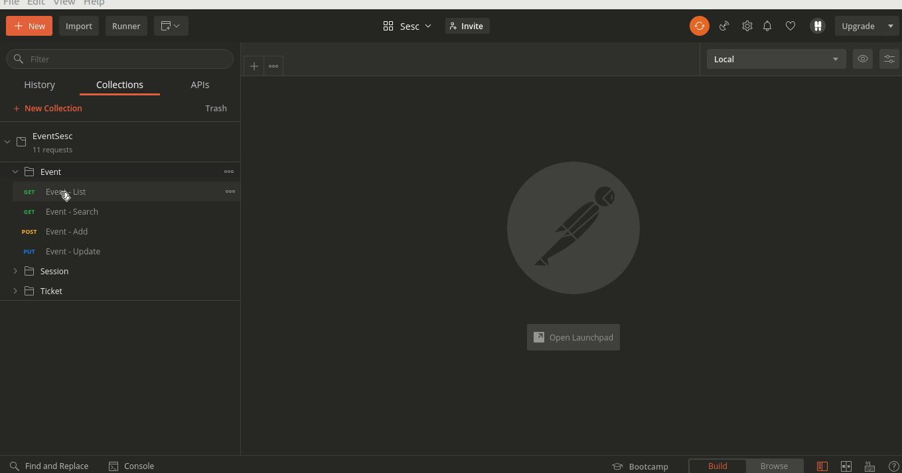

<h1>
    
</h1>

## ✏️ Sobre

**EventSesc** é uma aplicação que tem a finalidade de gerenciar as vendas de ingressos dos eventos que serão realizados 
nas unidades do **Sesc de São Paulo**.

---

## 👨‍💻️ Tecnologias utilizadas

O projeto foi desenvolvido utilizando as seguintes tecnologias
- [Java](https://java.com/en/)
- [Maven](https://maven.apache.org/)
- [Spring](https://spring.io/)
- [MySQL](https://www.mysql.com/)
- [Flyway](https://flywaydb.org/)

---

## 📦️ Baixar e Executar o MySQL

Antes de executar a aplicação é necessário possuir o MySQL instalado ou possuir a instancia de
um container excutando uma imagem do MySQL na porta: 3306

Abaixo os comandos para a intalaçao do MyQSL caso esteja utilizando linux

```bash 
    # Atualizar os indices de pacotes
    $ sudo apt update

    # Instalar o pacote mysql-server
    $ sudo apt install mysql-server

    # Executar o script de configuração de segurança
    $ sudo mysql_secure_installation
```
Após a instalação do MySQL e a criação de um usuário no banco de dados, é necessário
configurar essas credenciais no arquivo **application-dev.properties** nas variáveis:
- spring.datasource.username
- spring.datasource.password

---
## 📦️ Baixar e Executar a Aplicação

```bash 
    
    # clonar o repositório
    $ git clone git@github.com:t-basilio/eventsescsp-api.git

    # Entrar no diretório raiz do projeto
    $ cd eventsescsp-api

    # Instalar as depências necessárias e gerar o jar
    $ ./mvnw clean install

    # Iniciar a aplicaçao (localhost porta 8080)
    $ java -jar target/eventsesc-api-0.0.1-SNAPSHOT.jar
```
---
Desenvolvido por Thiago Basilio no processo seletivo do [Sesc SP](https://www.sescsp.org.br/) 🚀️ 